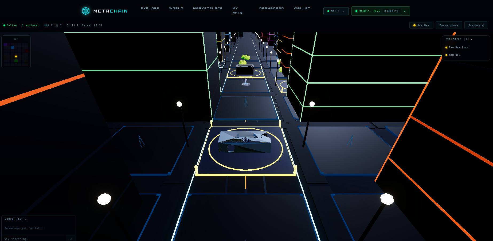
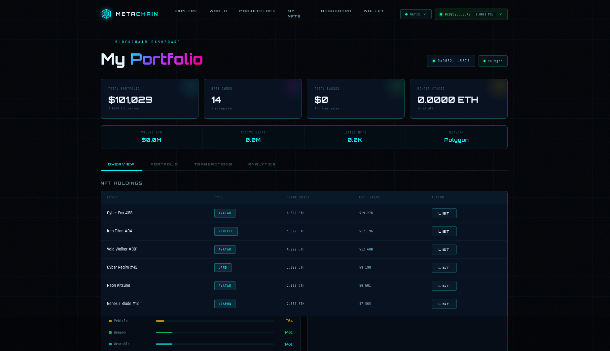

# MetaChain Metaverse

A full-stack blockchain metaverse application with a 3D virtual world, NFT marketplace, wallet integration, parcel ownership, avatars, dashboards, and real-time multiplayer powered by WebSockets.

## Overview

MetaChain is structured as two apps in one repository:

- `frontend/`: Next.js 14 client for the metaverse, marketplace, wallet flow, dashboards, and 3D world UI
- `backend/`: Express.js API with MySQL persistence, marketplace logic, parcel and avatar APIs, and Socket.IO multiplayer

## Features

- Explore a 3D metaverse world in the browser
- Connect MetaMask or WalletConnect using `wagmi`
- Browse and buy NFT listings in the marketplace
- Claim and manage virtual land parcels
- Customize avatars and sync updates in real time
- View blockchain-inspired portfolio and dashboard data
- Track online players and send world chat messages
- Use seeded MySQL data for local demo and development

## Tech Stack

- Frontend: Next.js 14, React 18, Three.js, Wagmi, Viem, TanStack Query, Socket.IO client
- Backend: Node.js, Express.js, Socket.IO, MySQL2, Helmet, CORS, Morgan, Winston
- Database: MySQL

## Project Structure

```text
metaverse-blockchain/
├── README.md
├── frontend/
│   ├── app/
│   ├── components/
│   ├── hooks/
│   ├── lib/
│   ├── providers/
│   └── public/
├── backend/
│   ├── config/
│   ├── controllers/
│   ├── middleware/
│   ├── routes/
│   └── utils/
└── docs/
    └── screenshots/
```

## Screenshots

Add your frontend screenshots in `docs/screenshots/`, then update the file names below if needed.

### Home


### 3D World



### Marketplace


### Dashboard



If you have different image names, just replace the paths in this section.

## Local Setup

### 1. Backend

```bash
cd backend
npm install
npm run db:init
npm run dev
```

Create a `.env` file in `backend/`:

```env
PORT=4000
FRONTEND_URL=http://localhost:9094

DB_HOST=localhost
DB_PORT=3306
DB_USER=root
DB_PASSWORD=
DB_NAME=metachain_db
```

### 2. Frontend

```bash
cd frontend
npm install
npm run dev
```

Create a `.env.local` file in `frontend/`:

```env
NEXT_PUBLIC_API_URL=http://localhost:4000/api
NEXT_PUBLIC_WS_URL=http://localhost:4000
NEXT_PUBLIC_WALLETCONNECT_PROJECT_ID=demo
NEXT_PUBLIC_ALCHEMY_KEY=
NEXT_PUBLIC_APP_NAME=MetaChain
NEXT_PUBLIC_APP_DESCRIPTION=Blockchain Metaverse Platform
NEXT_PUBLIC_APP_URL=http://localhost:9094
NEXT_PUBLIC_APP_ICON=/icon.png
```

Frontend runs on `http://localhost:9094` and backend runs on `http://localhost:4000`.

## Main Pages

- `/`: landing page with hero, features, featured NFTs, roadmap, and CTA
- `/world`: interactive multiplayer metaverse world
- `/marketplace`: NFT listings, filters, stats, and buy flow
- `/dashboard`: wallet-driven portfolio and activity dashboard
- `/wallet`: wallet-related account view
- `/my-nfts`: owned asset view

## API Modules

- `/api/nfts`
- `/api/wallet`
- `/api/chains`
- `/api/dashboard`
- `/api/marketplace`
- `/api/world`

## Multiplayer

The backend Socket.IO server powers:

- player join and leave events
- movement sync
- avatar updates
- world chat
- online player count

## Database

The backend includes a database initializer at `backend/utils/dbInit.js` that:

- creates the MySQL database
- creates all required tables
- seeds sample NFTs, listings, transactions, balances, parcels, and world data

## Documentation

- [Frontend README](/opt/lampp/htdocs/jsproject/metaverse-blockchain/frontend/README.md)
- [Backend README](/opt/lampp/htdocs/jsproject/metaverse-blockchain/backend/README.md)

## Notes

- This repository is now ready to be used as a single GitHub project containing both frontend and backend.
- To make the screenshot section render on GitHub, place the actual image files into `docs/screenshots/`.
